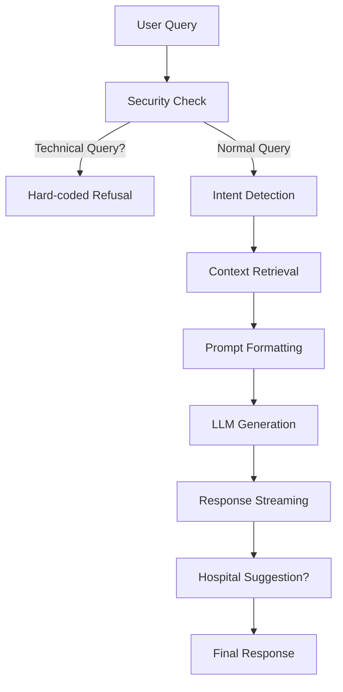
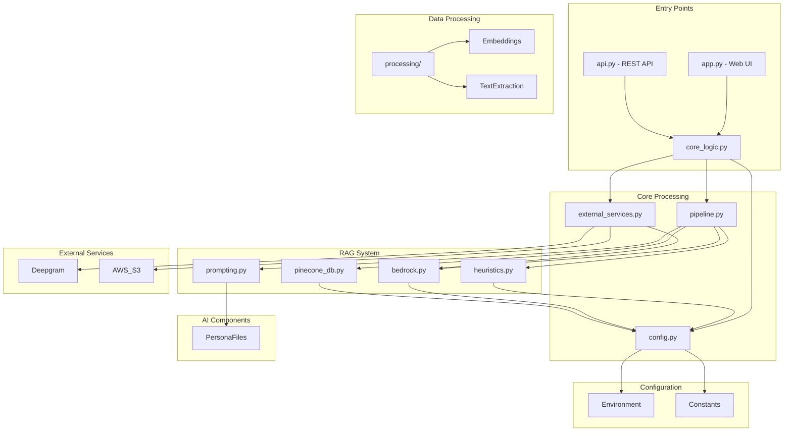

Now I have a complete understanding of the codebase. Let me provide a detailed explanation of the entire architecture:

## 🏗️ **Complete Codebase Architecture & Design Explanation**

### 📁 **Overall Structure**
```
mirai-psychology-chatbot/
├── app.py                  # Streamlit Web Interface
├── api.py                  # FastAPI REST API
├── src/
│   ├── api/                # Core API Services
│   ├── rag/                # RAG (Retrieval Augmented Generation) System
│   ├── prompts/            # AI Persona Definitions
│   ├── processing/         # Data Processing
│   └── utils/              # Utilities
└── config.py               # Configuration
```

## 🔄 **Data Flow & System Architecture**

### **1. Entry Points (How Users Interact)**

#### **A. Web Interface (`app.py`)**
- **Purpose**: Streamlit-based web application for end users
- **Key Components**:
  - Chat interface with text input
  - Voice input using microphone
  - File upload for document summarization
  - Voice output (text-to-speech)
- **Flow**:
  ```mermaid
  graph TD
    A[User Input] --> B[stream_process_user_input]
    B --> C[get_processed_response_stream]
    C --> D[RAG Pipeline]
    D --> E[Streamlit UI Response]
  ```

#### **B. REST API (`api.py`)**
- **Purpose**: FastAPI backend for programmatic access
- **Endpoints**:
  - `/chat/text` - Text-based chat
  - `/chat/audio` - Audio-based chat
  - `/summarize` - Document summarization
  - `/generate-soap` - Medical SOAP note generation
- **Authentication**: Uses `MIRA_KEY` environment variable
- **Flow**:
  ```mermaid
  graph TD
    A[HTTP Request] --> B[FastAPI Endpoint]
    B --> C[get_processed_response_stream]
    C --> D[RAG Pipeline]
    D --> E[StreamingResponse]
  ```

### **2. Core Processing Layer (`src/api/core_logic.py`)**

**The Brain of the System** - This is where all inputs converge and get processed.

```python
async def get_processed_response_stream(
    text_input: str = "",
    audio_bytes: bytes = None,
    file_bytes: bytes = None,
    file_name: str = None,
    content_type: str = None,
    chat_history: List[Dict[str, Any]] = None,
    status_callback: Optional[Callable[[str], None]] = None,
) -> AsyncGenerator[str, None]:
```

**Three Main Processing Paths**:

1. **Document Summarization Flow**
   - `file_bytes + file_name + content_type` → `process_uploaded_file()` → `get_summary_response()`

2. **Audio Chat Flow**
   - `audio_bytes` → `speech_to_text_interactive()` → `get_rag_response()`

3. **Text Chat Flow** (Most Common)
   - `text_input` → `get_rag_response()`

### **3. RAG Pipeline (`src/rag/pipeline.py`)**

**The Heart of the AI System** - Retrieval Augmented Generation



**Key Components**:

- **Security Layer**: Blocks technical/system queries immediately
- **Intent Detection**: Uses Bedrock LLM to determine query type
- **Context Retrieval**: Searches Pinecone vector database for relevant information
- **Prompt Formatting**: Creates structured prompts with persona, history, and context
- **LLM Generation**: Uses Bedrock's Llama3 model for response generation
- **Post-processing**: Adds hospital suggestions when appropriate

### **4. External Services (`src/api/external_services.py`)**

**Integration with Third-Party Services**:

- **Deepgram STT**: Speech-to-text for audio inputs
  - `speech_to_text_interactive()` - Simple transcription
  - `speech_to_text_prerecorded()` - Advanced with speaker diarization
- **Deepgram TTS**: Text-to-speech for voice responses
- **AWS S3**: File storage for audio uploads
- **Retry Mechanism**: Automatic retry for failed API calls

### **5. Configuration System (`src/config.py`)**

**Centralized Configuration Management**:

- **API Keys**: Bedrock, Deepgram, Pinecone
- **AWS Settings**: Region, model IDs
- **Pinecone Settings**: Index names, search parameters
- **File Processing**: Supported document/audio types
- **Hospital Triggers**: Keywords for hospital suggestions
- **Hospital Suggestions**: Predefined response templates

### **6. Prompt Management (`src/prompts/`)**

**AI Personality & Behavior Definitions**:

- **`factual_persona.txt`**: Hospital information assistant
  - Professional, factual responses
  - Medical safety protocols
  - Hospital information focus

- **`empathetic_persona.txt`**: Mental health companion
  - Emotional support focus
  - Crisis intervention protocols
  - Safety boundaries

### **7. Heuristics & Decision Making (`src/rag/heuristics.py`)**

**Rule-Based Decision Logic**:

- **`is_simple_greeting()`**: Detects basic greetings
- **`should_suggest_hospital()`**: Determines when to suggest hospital
- **`is_medication_emergency()`**: Detects medication misuse (NEW)
- **`get_medication_emergency_response()`**: Emergency response template (NEW)

### **8. Data Processing (`src/processing/`)**

- **`embedding.py`**: Text embedding for vector search
- **`ingestion.py`**: Document processing and text extraction

### **9. Utilities (`src/utils/`)**

- **`helpers.py`**: Logging setup, retry decorators
- **Error Handling**: Consistent error logging
- **Retry Logic**: Automatic retry for transient failures

## 🔗 **File Relationships & Dependencies**



## 🎯 **Design Rationale & Key Decisions**

### **1. Modular Architecture**
- **Why**: Separation of concerns for maintainability
- **Benefits**: Easy to update individual components without affecting others

### **2. Streaming Responses**
- **Why**: Better user experience, real-time feedback
- **Implementation**: Async generators throughout the pipeline

### **3. Multi-Input Support**
- **Why**: Accommodate different user preferences
- **Types**: Text, voice, document uploads

### **4. Safety-First Design**
- **Why**: Medical/psychological context requires caution
- **Features**: Emergency detection, crisis protocols, content filtering

### **5. Dual Interface Approach**
- **Why**: Serve both end users and developers
- **Interfaces**: Web UI (Streamlit) + REST API (FastAPI)

### **6. Configuration-Driven**
- **Why**: Easy deployment across environments
- **Implementation**: Centralized config with environment variables

### **7. Comprehensive Error Handling**
- **Why**: Robust operation in production
- **Features**: Retry mechanisms, detailed logging, graceful degradation

## 🚀 **Key Features & Capabilities**

### **1. Multi-Modal Input Processing**
- Text chat
- Voice input/output
- Document upload & summarization
- SOAP note generation from audio

### **2. Advanced Safety Systems**
- Medication emergency detection
- Crisis intervention protocols
- Content filtering
- Progressive violation tracking

### **3. Context-Aware Responses**
- Retrieval Augmented Generation
- Conversation history tracking
- Persona-based response styling

### **4. Hospital Integration**
- Doctor information lookup
- Hospital service details
- Appropriate referrals

### **5. Scalable Architecture**
- Async I/O throughout
- Cloud service integration
- Container-ready design

## 🔧 **How It All Works Together**

**Example Flow: User Asks About Diabetes Medication**

1. **Input**: User types "I took diabetes tablets for a headache, is it okay?"
2. **Entry Point**: `app.py` receives text input
3. **Core Logic**: `get_processed_response_stream()` routes to text chat flow
4. **RAG Pipeline**: 
   - Security check passes (not technical query)
   - Intent detection identifies as medical query
   - **Medication emergency detection triggers** (NEW)
   - Immediate emergency response generated
5. **Response**: Emergency contact information and safety advice returned
6. **UI**: Streamlit displays the emergency response to user

**Example Flow: User Uploads Document**

1. **Input**: User uploads PDF file
2. **Entry Point**: `app.py` receives file upload
3. **Core Logic**: Routes to document summarization flow
4. **Processing**: `process_uploaded_file()` extracts text
5. **Summarization**: `get_summary_response()` generates concise summary
6. **Response**: Document summary returned to user

## 🎯 **Summary**

This is a sophisticated **Retrieval-Augmented Generation (RAG) system** specifically designed for **psychological/medical assistance** with:

- **Multi-modal input/output** (text, voice, documents)
- **Advanced safety systems** for medical emergencies
- **Context-aware responses** using vector search
- **Dual interface** (web + API) architecture
- **Modular, maintainable design** with clear separation of concerns

The system prioritizes **user safety** while providing **helpful, context-aware information** through a combination of **rule-based heuristics** and **AI-powered generation**.
